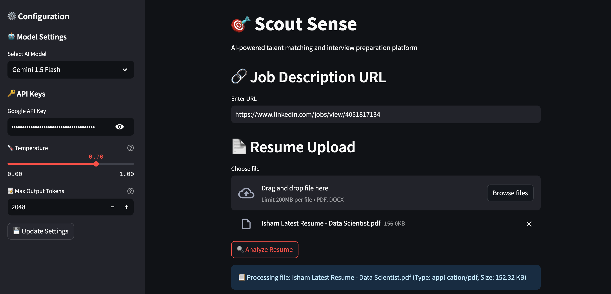
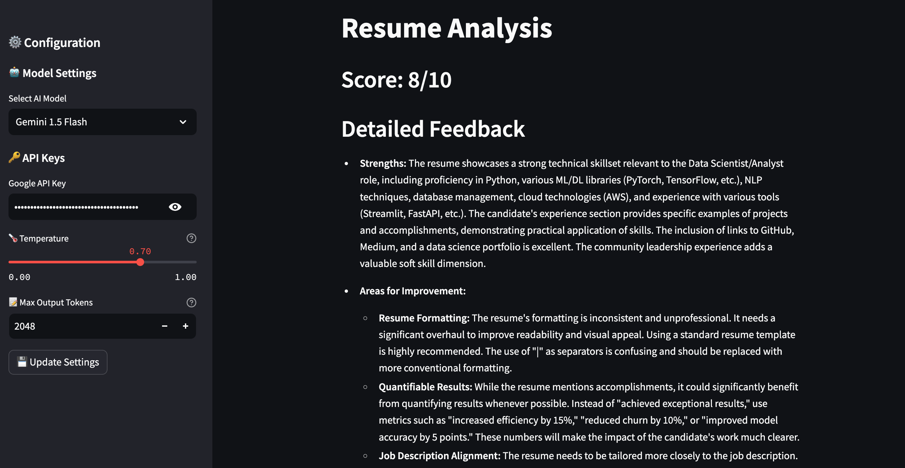
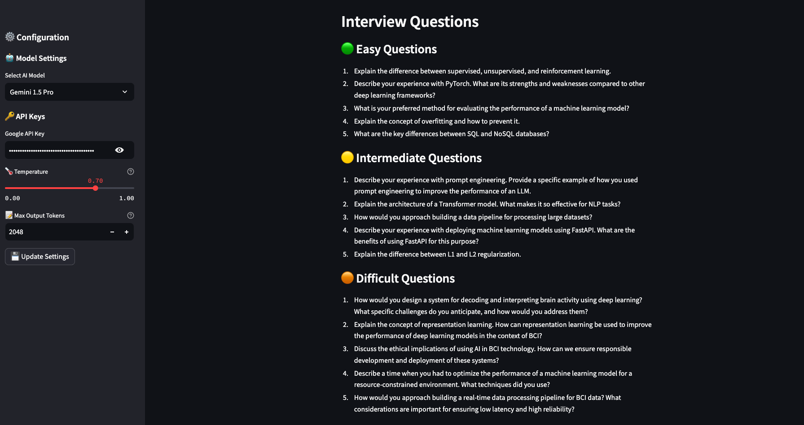

# 🎯 Scout Sense - Resume Rater

An AI-powered talent matching and interview preparation platform that analyzes resumes against job descriptions to provide compatibility scores and generate tailored interview questions.

## Project Structure

```
scout-sense/
├── src/
│   ├── models/
│   │   ├── __init__.py
│   │   └── schemas.py          # Data models and schemas
│   ├── services/
│   │   ├── __init__.py
│   │   ├── document_parser.py  # PDF and DOCX parsing
│   │   ├── job_scraper.py     # Job description scraping
│   │   └── ai_analyzer.py     # AI analysis
│   ├── utils/
│   │   ├── __init__.py
│   │   ├── config.py          # Configuration management
│   │   └── constants.py       # Environment variables and constants
│   ├── __init__.py
│   └── main.py                # Main Streamlit application
├── config.yaml                # Application configuration
├── .env                       # Environment variables
├── .env.example              # Example environment variables
├── .gitignore
├── README.md
└── requirements.txt
```

## ✨ Features

- 📄 Upload resume in PDF or DOCX format
- 🔗 Provide job description URL for analysis
- 🤖 Multiple AI model options:
  - OpenAI Models:
    - GPT-4o (gpt-4o)
    - GPT-4o Mini (gpt-4o-mini)
  - Google Models:
    - Gemini 1.5 Pro
    - Gemini 1.5 Flash
- ⚙️ Interactive configuration:
  - 🔑 Real-time API key management
  - 🎛️ Adjustable model parameters:
    - 🌡️ Temperature control
    - 📝 Token limits
    - ⚡ Model-specific settings
- 🎯 AI-powered resume analysis and scoring
- 💡 Detailed feedback on candidate's fit for the role
- ❓ Automatic generation of interview questions (for scores ≥ 7/10)
- 🎯 Questions categorized by difficulty:
  - 🟢 Easy
  - 🟡 Intermediate
  - 🟠 Difficult
  - 🔴 Extremely Difficult

## ⚙️ Configuration

The application offers multiple ways to configure its behavior:

### 🔑 API Keys
You can provide API keys in Streamlit UI:
   - Input keys directly in the sidebar
   - Keys are stored securely in the session

### 🎛️ Model Settings
Configure model parameters through:
1. config.yaml file:
   ```yaml
   models:
     gpt4o:
       temperature: 0.7
       max_tokens: 2048
     gemini_pro:
       temperature: 0.7
       max_output_tokens: 2048
   ```
2. Interactive UI:
   - Adjust temperature
   - Set token limits
   - Update settings in real-time

## 📋 Prerequisites

- Python 3.10+
- OpenAI API key (for GPT-4o, GPT-4o-mini)
- Google API key (for Gemini Pro, Gemini 1.5 Pro, Gemini 1.5 Flash)
- Conda (for environment management)

## 🚀 Installation

1. Clone the repository:
```bash
git clone [repository-url]
cd scout-sense
```

2. Create and activate a conda environment:
```bash
conda create -n scout-sense python=3.10
conda activate scout-sense
```

3. Install the required packages:
```bash
pip install -r requirements.txt
```

4. Create a .env file:
```bash
cp .env.example .env
```

5. Add your API keys to the .env file or provide them through the UI.

## 🏃‍♂️ Running the Application

1. Activate the conda environment if not already activated:
```bash
conda activate scout-sense
```

2. Start the Streamlit server:
```bash
streamlit run src/main.py
```

3. Open your web browser and navigate to:
```
http://localhost:8501
```

## 📖 Usage

1. 🔑 Configure API Keys:
   - Enter your OpenAI and/or Google API keys in the sidebar
   - Keys are required only for the models you plan to use

2. 🤖 Select and Configure Model:
   - Choose your preferred AI model from the dropdown
   - Adjust model parameters if desired:
     - Temperature (controls creativity)
     - Token limits (controls response length)

3. 📊 Analyze Resume:
   - Enter the job description URL
   - Upload a resume (PDF or DOCX)
   - Click "Analyze Resume"

4. 📈 View Results:
   - Compatibility score (0-10)
   - Detailed feedback
   - Interview questions (if score ≥ 7)

## 📸 Screenshots







## 🧩 Components

### 📊 Models
- `schemas.py`: Defines data models for job descriptions and analysis results

### 🛠️ Services
- `document_parser.py`: Handles PDF and DOCX file parsing
- `job_scraper.py`: Scrapes and processes job descriptions from URLs
- `ai_analyzer.py`: Manages AI model interactions and analysis

### ⚙️ Utils
- `config.py`: Configuration management and validation
- `constants.py`: Environment variables and system constants

## 🛠️ Technologies Used

- Streamlit
- OpenAI GPT-4O Series
- Google Gemini Series
- PyPDF2
- python-docx
- Beautiful Soup 4
- Pydantic
- PyYAML

## 📝 Notes

- The application requires an active internet connection to:
  - 🌐 Scrape job descriptions
  - 🤖 Communicate with AI APIs
- 📊 Large resumes or complex job descriptions may take longer to process
- 📈 The quality of the analysis depends on:
  - Clarity of resume and job description
  - Selected model and its configuration
  - Quality of extracted text from documents

---
Made with ❤️ using Streamlit • Powered by Scout Sense 🎯
